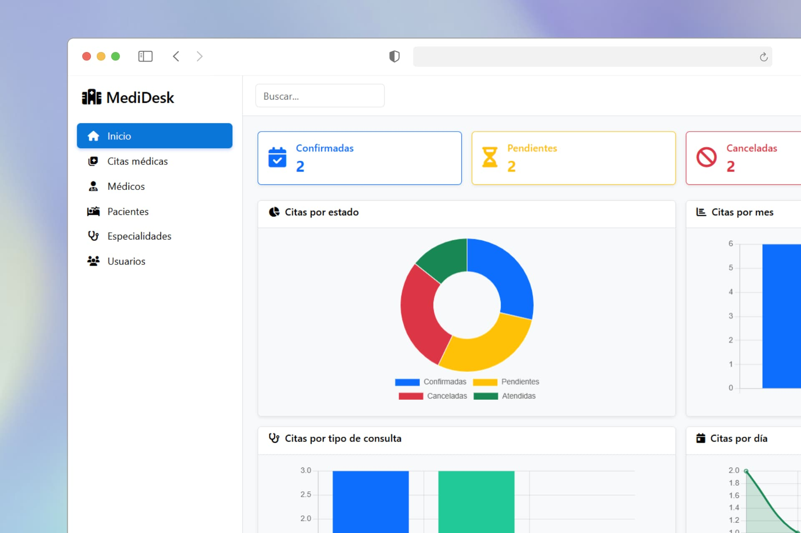

<div align="center">
  <a href="#">
    
  </a>
  <p></p>
</div>

<div align="center">


</div>

A modern, responsive, and secure web application for managing medical appointments. Designed for administrators, doctors, and patients with features like light/dark mode, user roles, calendar scheduling, and exportable reports.

## 🚀 Features

- 🔐 Role-based access (Admin, Doctor, Patient)
- 🗓️ Appointment scheduling with calendar
- ☁️ Cloudinary image upload integration
- 📁 Export reports (PDF & Excel)
- 🌙 Light/Dark mode toggle
- 📊 Dashboard with real-time stats
- 📱 Fully responsive interface

## 📂 Project Structure

```
medidesk/
├── MediDesk.sln
├── Api/                  # REST API (.NET 8)
│   ├── Controllers/       # API endpoints
│   ├── Repositories/      # Data access layer
│   ├── cloudinary.json.example
│   ├── appsettings.json
│   ├── appsettings.Local.json.example
│   └── Program.cs
├── Web/                  # ASP.NET Core MVC frontend
│   ├── Controllers/
│   ├── Views/
│   ├── wwwroot/
│   ├── appsettings.json
│   └── appsettings.Local.json.example
├── Shared/               # Shared DTOs & models
│   └── DTOs/
├── Database/             # Database scripts
│   ├── schema.sql
│   ├── data.sql
│   ├── Procedures/
│   └── init.sql
└── LICENSE
```

## 🔧 Setup Instructions

Follow these steps to run the project locally:

### 1. Clone the repository
```bash
git clone https://github.com/jaycodev/medidesk.git
cd medidesk
```

### 2. Configure settings
Copy the example config files and edit them with your values:

```bash
cp Api/cloudinary.json.example Api/cloudinary.json
cp Api/appsettings.Local.json.example Api/appsettings.Local.json
cp Web/appsettings.Local.json.example Web/appsettings.Local.json
```

#### `cloudinary.json`
```json
{
  "Cloudinary": {
    "CloudName": "your_cloud_name",
    "ApiKey": "your_api_key",
    "ApiSecret": "your_api_secret"
  }
}
```

#### `appsettings.Local.json`
```json
{
  "ConnectionStrings": {
    "DB": "server=YOUR_SERVER; database=MediDesk; Integrated Security=true; TrustServerCertificate=true"
  }
}
```

### 3. Set up the database
Open **init.sql** in SQL Server Management Studio (SSMS) with **SQLCMD Mode enabled** ⚠️.  

Edit the path variable if needed:
```sql
:setvar DatabasePath "C:\Repositories\medidesk\Database"
```

Then execute the script to create schema, seed data, and procedures.

### 4. Run the solution
Open `MediDesk.sln` and start both projects:

- **Api** → REST API (.NET 8, Swagger enabled)  
- **Web** → ASP.NET Core MVC frontend  

## 🛠️ Tech Stack

- **Backend API:** ASP.NET Core 8 (Minimal hosting, Swagger, Repositories pattern)  
- **Frontend:** ASP.NET Core MVC (Razor Views, Bootstrap, jQuery, DataTables)  
- **Database:** SQL Server 2019+  
- **Cloud Storage:** [Cloudinary](https://cloudinary.com/) for image management  
- **Authentication:** Custom role-based system (Admin, Doctor, Patient)  
- **PDF Generation:** [iText7](https://itextpdf.com/) (`9.2.0`)  
- **Excel Export:** [ClosedXML](https://github.com/ClosedXML/ClosedXML) (`0.105.0`)  
- **UI Enhancements:** Bootstrap, Modernizr, Light/Dark mode toggle  
- **Client-Side Validation:** jQuery Validation + Unobtrusive  

## 💾 Database

All scripts are inside `/Database/`.  
Use `init.sql` for a complete setup, or run `schema.sql`, `data.sql`, and individual scripts from `/Procedures/`.

## 🧑‍💻 Contributors

<a href="https://github.com/jaycodev/medidesk/graphs/contributors">
  
</a>

## 📄 License

This project is licensed under the [MIT License](./LICENSE).
